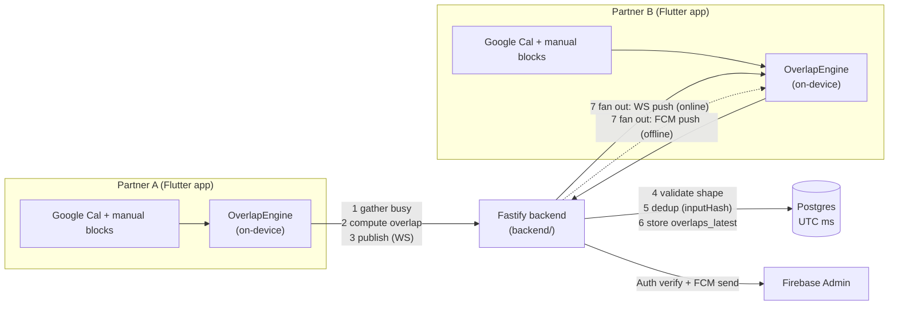
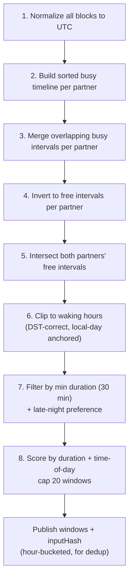
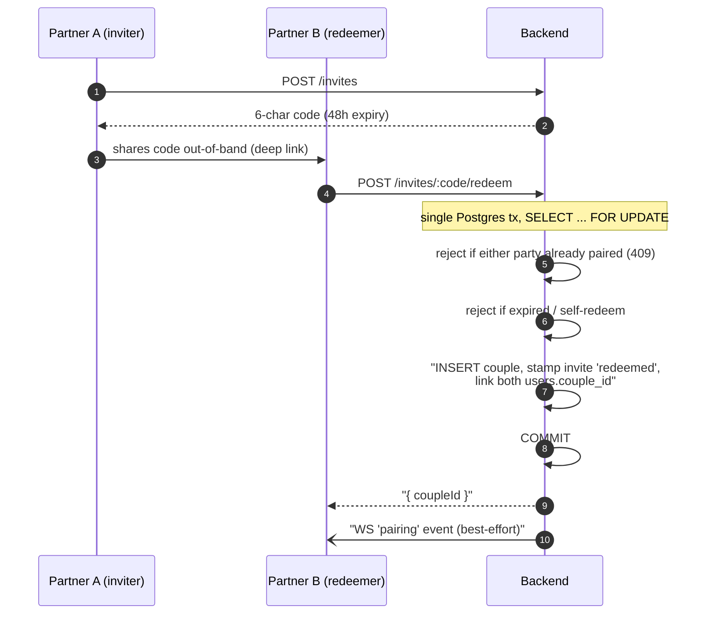
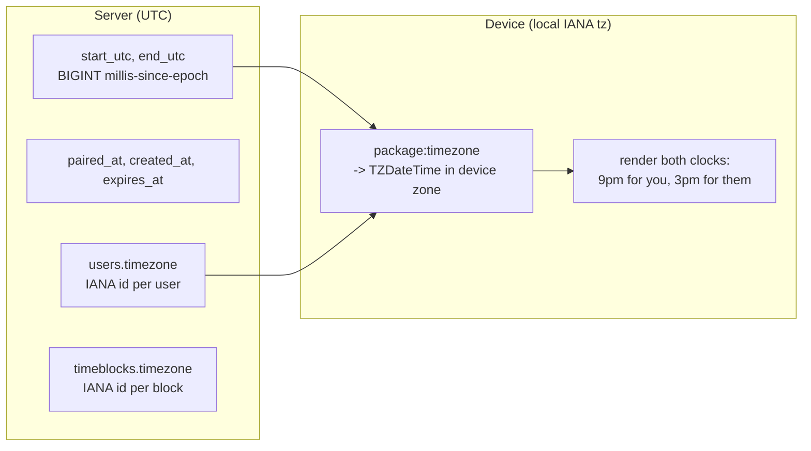

# Couple Sync

A mobile app (iOS + Android, Flutter) that helps long-distance couples find **mutual free time** — combining calendars, custom time blocks, and timezones to surface windows when both partners are free, even across timezones.

> "When are you free?" should never be a hard question. Couple Sync answers it automatically.

---

## How it works

The one thing to understand: **the device computes overlap, not the server.**

Each partner's phone gathers busy intervals (Google Calendar freebusy + manually-added blocks), runs the overlap algorithm locally, and publishes the resulting free-time windows to the backend over a WebSocket. The backend only **validates the shape, dedups, stores, and fans out** to the other partner — it never recomputes. This keeps the server cheap and the math verifiable client-side.

- **Server-side time is UTC everywhere** (millis-since-epoch `BIGINT`s). No server timezone math, no DST edge cases on the backend.
- **The device renders in its own local IANA timezone** (`package:timezone`). Both partners' clocks are shown side by side ("9pm for you, 3pm for them").
- **Privacy-first calendar sync:** Google Calendar `freebusy` API only — busy intervals, never event titles. No calendar content is stored on the server beyond busy blocks.

### Data flow at a glance



If the partner is online, the new windows go straight over their WS socket. If they're offline, the backend sends an **FCM push** ("New free window found: tomorrow 8–10pm your time"). On reconnect, a partner fetches the stored latest overlap via `GET /overlaps/latest`.

### Overlap algorithm (on-device)

`lib/core/overlap/overlap_engine.dart` — a pure function over a 14-day horizon:



### Pairing flow (invite code)



Deep links: `/invite/:code` is mapped by the router and preserved through the auth flow, so an unauthenticated user lands on a pre-filled "enter code" screen after signing in.

### Timezone handling



The onboarding screen auto-detects the device timezone; `hasTimezone` gates the guard until the user confirms one.

---

## Stack

**App:** Flutter `^3.11.0` · Riverpod (state) · go_router (nav, redirect guards) · `package:timezone` (DST-correct display) · Hive (local cache) · Firebase Auth + FCM.

**Backend:** Fastify 4 (HTTP REST) · `@fastify/websocket` (WS sync) · `pg` → Postgres 16 · `firebase-admin` (verify ID tokens, send FCM) · `node-cron` (daily 03:00 UTC invite cleanup) · pino · Node 22, TypeScript, pnpm, vitest.

**Infra:** Docker (multi-stage, non-root) · Coolify/Traefik (managed platform, TLS termination) · GitHub Actions CI · Fastlane (store deploy).

> Firebase is **Auth + FCM + hosting only**. There is no Firestore, no Cloud Functions — the data layer is Postgres behind the Fastify backend. (The repo's older docs may still mention Firestore/Functions; they're being corrected.)

---

## Quickstart

```bash
make deps          # flutter pub get + backend pnpm install

# local stack (postgres + api via docker compose)
cp backend/.env.example backend/.env    # fill in FIREBASE_PROJECT_ID + FIREBASE_SERVICE_ACCOUNT_JSON
docker compose up -d --build             # api on http://localhost:3000, migrations run on start

# or run the app against it
flutter run
```

Backend-only iteration:

```bash
docker compose up postgres -d
cd backend && pnpm install && pnpm migrate && pnpm dev   # tsx watch → :3000
```

Health check: `GET http://localhost:3000/health` → `{ "status": "ok", "time": <ms> }`.

### Common commands

```bash
flutter analyze                    # static analysis
flutter test                       # unit + widget tests
cd backend && pnpm test            # vitest (auth, pairing, overlap, blocks, sync)
cd backend && pnpm build           # tsc → dist/
make lint                          # both
make test                          # flutter test + backend vitest
make build-web                     # flutter web build
```

---

## Repo layout

```
lib/
├── main.dart, app.dart            # entry, Firebase init, MaterialApp.router
├── core/
│   ├── models/                    # User, Couple, Invite, TimeBlock, OverlapResult
│   ├── overlap/                   # overlap_engine.dart (pure algo) + controller
│   ├── router/                    # go_router + redirect guards (auth→tz→pairing→home)
│   ├── theme/                     # AppTheme, AppColors (MD3)
│   └── utils/                     # timezone, formatting, week pagination
├── features/                      # auth, onboarding, pairing, home, calendar,
│                                  # blocks, overlap, settings
└── services/
    ├── auth_service.dart          # Firebase Auth wrapper
    ├── sync_service.dart          # HTTP + WS + Hive cache (data layer)
    ├── calendar_service.dart      # Google freebusy (privacy-first)
    └── notification_service.dart  # FCM

backend/                           # self-hosted Fastify + Postgres + WS
├── src/
│   ├── index.ts                   # Fastify + ws + cron bootstrap
│   ├── routes/{auth,sync,blocks,overlaps,users,couples,invites}.ts
│   ├── overlap.ts                 # WS overlap handler (validate/dedup/store/fanout/FCM)
│   ├── cron.ts                    # admin routes + invite cleanup cron
│   ├── auth.ts, couples.ts        # token verify + assertMember (membership guard)
│   ├── db.ts, firebase.ts, config.ts, migrate.ts
│   └── migrations/001_init.sql    # users, couples, invites, timeblocks, overlaps_latest
└── Dockerfile                     # multi-stage Node 22
```

---

## Documentation

- **[`PRD.md`](PRD.md)** — product requirements, vision, success metrics.
- **[`ARCHITECTURE.md`](ARCHITECTURE.md)** — full system design and data model.
- **[`backend/README.md`](backend/README.md)** — backend API surface, env reference, deploy guide (the source of truth for the backend).
- **[`AGENTS.md`](AGENTS.md)** — conventions and patterns for agentic development.
- **[`docs/`](docs/)** — design specs and implementation plans.

---

## License

See [`LICENSE`](LICENSE).
